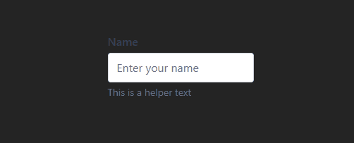

# Internshala Assignment - React Component Library

A modern React component library built with TypeScript, Tailwind CSS, and Storybook, featuring reusable InputField and DataTable components with comprehensive documentation and interactive examples.

## 🚀 Live Demos

- **Main Application**: Local development server
- **Storybook Documentation**: Interactive component playground

## 📋 Table of Contents

- [Features](#features)
- [Tech Stack](#tech-stack)
- [Prerequisites](#prerequisites)
- [Installation](#installation)
- [Development](#development)
- [Components](#components)
- [Scripts](#scripts)
- [Project Structure](#project-structure)
- [Description of My Approach](#description-of-my-approach)

## ✨ Features

### InputField Component

- **Multiple Variants**: Filled, Outlined, Ghost
- **Size Options**: Small, Medium, Large
- **State Management**: Default, Disabled, Invalid, Loading
- **Interactive Features**: Clear button, Password toggle with eye icons
- **Theme Support**: Light and Dark theme variants
- **Type Safety**: Full TypeScript support with strict prop types
- **Accessibility**: ARIA labels, keyboard navigation, focus management

### DataTable Component

- **Generic Type Support**: Works with any data structure
- **Column Configuration**: Sortable columns with visual indicators
- **Row Selection**: Individual and bulk selection with master checkbox
- **State Handling**: Loading spinner, Empty state with icons
- **Interactive UI**: Hover effects, selection highlighting
- **Modern Styling**: Professional appearance with rounded corners and shadows

## 🛠 Tech Stack

- **React 19** - Latest React with modern features
- **TypeScript** - Type-safe development
- **Vite** - Fast build tool and dev server
- **Tailwind CSS 4** - Utility-first CSS framework
- **Storybook 9** - Component documentation and testing
- **ESLint** - Code linting and quality
- **PostCSS** - CSS processing

## 📋 Prerequisites

Before running this project, make sure you have:

- **Node.js** (version 22.12+ recommended)
- **npm** (comes with Node.js)
- **Git** (for cloning the repository)

## 🔧 Installation

1. **Clone the repository**

   ```bash
   git clone https://github.com/IbadS17/internshala-assignment.git
   cd internshala-assignment
   ```

2. **Install dependencies**

   ```bash
   npm install
   ```

3. **Start the development server**

   ```bash
   npm run dev
   ```

4. **Launch Storybook (in a separate terminal)**
   ```bash
   npm run storybook
   ```

## 🚀 Development

### Running the Application

```bash
# Start development server
npm run dev
# Application will be available at http://localhost:5173
```

### Running Storybook

```bash
# Start Storybook server
npm run storybook
# Storybook will be available at http://localhost:6006
```

### Building for Production

```bash
# Build the application
npm run build

# Build Storybook
npm run build-storybook
```

## 🧩 Components

### InputField

A versatile input component with multiple variants, sizes, and interactive features.

**Props:**

- `variant`: "filled" | "outlined" | "ghost"
- `size`: "sm" | "md" | "lg"
- `type`: "text" | "password"
- `theme`: "light" | "dark"
- `disabled`, `invalid`, `loading`: boolean states
- `showClearButton`: boolean for clear functionality
- `label`, `placeholder`, `helperText`, `errorMessage`: string content

### DataTable

A generic, feature-rich table component with sorting and selection.

**Props:**

- `data`: Array of objects to display
- `columns`: Column configuration with sorting options
- `selectable`: Enable row selection
- `loading`: Show loading state
- `onRowSelect`: Callback for selection changes

## 📜 Scripts

| Command                   | Description              |
| ------------------------- | ------------------------ |
| `npm run dev`             | Start development server |
| `npm run build`           | Build for production     |
| `npm run lint`            | Run ESLint               |
| `npm run preview`         | Preview production build |
| `npm run storybook`       | Start Storybook          |
| `npm run build-storybook` | Build Storybook          |

## 📁 Project Structure

```
src/
├── components/          # Reusable components
│   ├── InputField.tsx   # Input component with variants
│   └── DataTable.tsx    # Generic table component
├── stories/             # Storybook stories
│   ├── InputField.stories.tsx
│   └── DataTable.stories.tsx
├── App.tsx             # Main application component
├── main.tsx            # Application entry point
└── index.css           # Global styles with Tailwind
```

## 🎯 Description of My Approach

I designed the components with a focus on reusability, scalability, and accessibility. Using TypeScript, I defined strict prop types to ensure type safety. Tailwind CSS was used for responsive and modern styling with support for multiple variants and sizes.

The InputField includes validation states, helper/error text, and optional features like a clear button and password toggle. The DataTable is built to be generic, supporting column sorting, row selection, and loading/empty states.

Both components are documented in Storybook with interactive states and deployed via Chromatic for easy sharing and testing.

## 🎥 GIFs

### InputField Interactions



### DataTable Interactions


